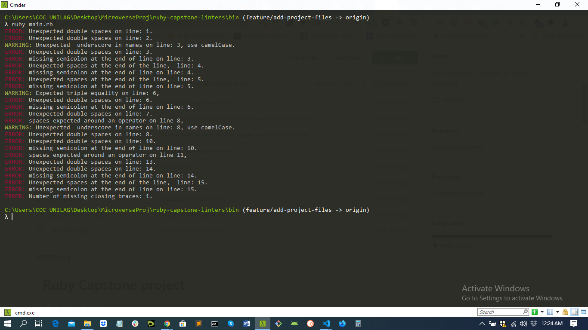

<h1 align="center">ruby-capstone-linters</h1>

---

## 📝 Content

<p align="center">
<a href="#about">About</a>&nbsp;&nbsp;&nbsp;|&nbsp;&nbsp;&nbsp;
<a href="#builtwith">Built with</a>&nbsp;&nbsp;&nbsp;|&nbsp;&nbsp;&nbsp;
<a href="#installing">Installing</a>&nbsp;&nbsp;&nbsp;|&nbsp;&nbsp;&nbsp;
<a href="#testing">Testing</a>&nbsp;&nbsp;&nbsp;|&nbsp;&nbsp;&nbsp;
<a href="#styleguide">Style Guide</a>&nbsp;&nbsp;&nbsp;|&nbsp;&nbsp;&nbsp;
<a href="#author">Author</a>
</p>

## ✒️ About <a name = "about"></a>

<p align="center">
This is a ruby linter that helps you check for JavaScript linting errors and enforce good styling guide conventions in your code.</p>

## 

## 🔧 Built with<a name = "builtwith"></a>

- [Ruby](https://rubyonrails.org/)
- RSpec for Ruby Testing
- Colorize gem

## 🛠 Installing <a name = "installing"></a>

### Pre-requisites

- Ruby installed on local machine. Check [this](https://www.ruby-lang.org/en/documentation/installation/) for Installation Guide

* Rubocop Linter installed on Machine

  Install Using this command:

  ```
  gem install rubocop

  ```

* Rspec for testing installed on Machine

  Install Using this command:

  ```
  gem install rspec

  ```

* Colorize Gem installed on Machine

  Install Using this command:

  ```
  gem install colorize

  ```

## Usage

Clone this repository

```
git clone https://github.com/uimarshall/ruby-capstone-linters.git
```

```
cd ruby-capstone-linters
```

Type in the following command to run the linter on a css file in the folder

```
ruby bin/main.rb

```

## Testing Instructions <a name = "testing"></a>

- Clone the repository
- Change directory to the cloned directory `cd ruby-capstone-linters`
- Run `bundle install` to install the dependencies specified in the Gemfile
- Run `rspec` to test

## Style Guide <a name = "styleguide"></a>

<p> This Linter Enforces rules for the following </p>

### 1. Triple Equality

    Checks for triple equality

      ```
      # Bad Code
      let fst = "first"
      let scd = "first"
      fst == scd


      # Good Code
      let fst = "first";
      let scd = "first";
      fst === scd;
      ```

### 2.Camel Case

      Check for case sensitivity in naming variables.

        ```
        # Bad Code
        let FavColor = "green";
        let Hobby = "football";


        # Good Code
        let favColor = "green";
        let hobby = "football";
        ```

### 3. No Double Line

       Checks for unexpected double line

        ```
        # Bad Code
        interest = FavColor + Hobby+ best_music;

        function detectoffencies() {
            let arr  = [7, 9, 5, 4, +8];
            var res = showError(arr);
        }


        # Good Code
        interest = FavColor + Hobby+ best_music;
        function detectoffencies() {
            let arr  = [7, 9, 5, 4, +8];
            var res = showError(arr);
        }
        ```

### 4. Underscore in naming

        Checks that there is no underscore in naming

        ```
        # Bad Code
        food_things = "rice";


        # Good Code
        foodThings = "rice";
        ```

### 5. Space End Of Line

        Checks that there are no spaces at end of line

        ```
        # Bad Code
       if (condition) {
         "go"


        # Good Code
        if (condition) {
          return "go"
        }
        ```

### 6. Missing closing braces

       Checks for missing closing braces

        ```
         # Bad Code
       if (condition) {
         "go"


        # Good Code
        if (condition) {
          return "go"
        }
        ```

## ✒️ Author <a name = "author"></a>

👤 **Marshall Akpan**

- Github: [uimarshall](https://github.com/uimarshall)
- Twitter: [uimarshall](https://twitter.com/uimarshall)
- Linkedin: [Marshall Akpan](https://www.linkedin.com/in/marshall-akpan-19745526/)

## Contributing

- To contribute to this project:
- Fork this repository & clone locally.
- Create an upstream remote and sync your local copy.
- create a new branch.
- Push your code to your origin repository.
- Create a new Pull Request .
- Feel free to check the [issues page](https://github.com/uimarshall/ruby-capstone-linters/issues).

## 👍 Show your support

Give a ⭐️ if you like this project!

## :clap: Acknowledgements

- Microverse
